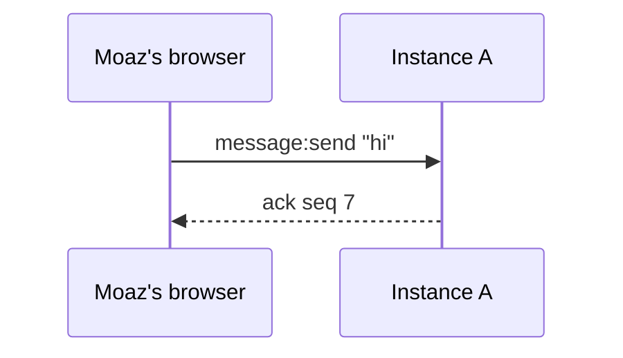

# <Project>: <lesson title>

<!-- One Markdown file per lesson. The agent asks every Check in chat and grades it there. -->

## What we are building

<Two short paragraphs. First: what the thing is, in plain words, for someone who has not seen it. Second: a real-world comparison that says what it is like and what it is not like ("like a live-stream chat, where the last few minutes matter; not like WhatsApp, where every message is kept forever"). Name the people in the story here: Moaz and Taha are the two users; instance A and instance B are two copies of the server.>

## Part 1: <plain title>

<One paragraph, 60 to 120 words, that explains what happens and why, before any diagram. Concrete first, the technical name once in parentheses.>

**Story.** <Two to four sentences following Moaz and Taha through this part. "Moaz types hi. His browser sends it to instance A. ...">

> **Check.** <One question the agent asks in chat once you say you have read this part. It must be unanswerable from the labels alone: use the story, a changed condition, or a wrong claim to correct. Never "put A before B".>

## Part 2: <plain title>

<same shape>

## Say it like an interviewer

<Four or five sentences to say out loud, first person.>

## Recall

<At most five exact strings worth keeping, each cued by a situation, with a one-line mnemonic. The agent asks these in chat as typed answers.>

- When a retry must not create a second row: `SET key value NX EX 300`. NX: only if Not eXists. EX: EXpires in seconds.

## Glossary

<Every backticked term above, one line each, in the order the reader meets them.>

- `INCR room:seq`: adds one to the room counter and returns the new value, atomically.

## Read the source

- <primary documentation, one line each>
